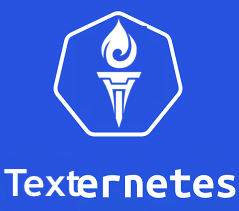

# Texternetes

# What is Texternetes?

Texternetes, known more affectionately as t8s is a Twilio-based SMS controller for your k8s cluster! In addition to this, t8s helps you provision and spin up a k8s cluster with an interactive interface.

# How to Run

This is a guide on how to run t8s, but may be missing some parts.

## Prerequisites

### Installed tools

* gcloud
* kubectl
* docker
* jq
* yq
* node
* npm
* ngrok

More when I think of them...

### Other

* Account on Google Cloud Platform
* Account on Azure (coming soon!)
* Twilio account and phone #

## Getting started

There are two main components that you need to install:

### t8s cli

Download the `t8s.sh` file and give it permissions to execute: `chmod +x t8s.sh`.
Download the `deployment.yml` file.

Change a couple things:

In the `deployment.yml` file, change `metada.name`, `spec.template.metadata.labels.app`, and `spec.template.spec.containers.name` to your App Name (the name you use for deployment (from `kubectl get deployment`))

In the `t8s.sh` script, change any occurrences of `<project path>` to the absolute path to your `deployment.yml` file.

### Twilio Node Server

Download the Twilio/GCP sample app:

`git clone https://github.com/GoogleCloudPlatform/nodejs-docs-samples`
`cd nodejs-docs-samples/appengine/twilio`

In that directory, replace `app.js` with the `twilio-server/app.js` from this repo. Also replace `package.json` with `twilio-server/package.json` in this directory.

## Ready to run!

### Twilio

1. Go into the directory where you downloaded the Twilio/GCP sample app (preferably, this is a different directory).
2. Now start the Twilio NodeJS server:
    * `npm install; npm start`
3. Open up a new terminal tab and start `ngrok` with `ngrok http 3000`
4. Put the URL that `ngrok` gives you into your Twilio number's config for the Messaging Webhook URL, with `/sms/receive` appended at the end.
5. Done

### t8s

1. Go to the directory with the NodeJS app you would like to deploy.
2. Copy `t8s.sh` and `deployment.yml` to the root of that directory (where your `app.js` is).
3. Run `t8s.sh init` to initialize your deployment.
    * Follow the steps that it walks you through.
4. Done

### It is now deployed!

You have now finished dockerizing, provisioning, and deploying your app!

## How to Use

### t8s cli 

There are many commands you can run:

* `t8s just update hacktech-t8s hello-world-node`
    * This will deploy a new version of your application
* `t8s just scale hacktech-t8s hello-world-node 7`
    * This scales your pods to the number at the end
* `t8s just rollback please`
    * This rolls back your deployment to the last stable version.
* `t8s init`
    * You can init a new cluster or re-init the current one.

Additionally, you can run any `kubectl` commands as normal.

**NOTE: if you forget any of the commands, you can run `t8s help` for help, or run a partial command and it will help you fill out the rest**

### Twilio (SMS)

Once you have deployed your app (using `t8s init`) you can run any of the other `t8s just...` commands by texting your Twilio phone number.

You can also run any `kubectl` commands via text using `k <command>`. For example: `k get pods` gets your pods.
